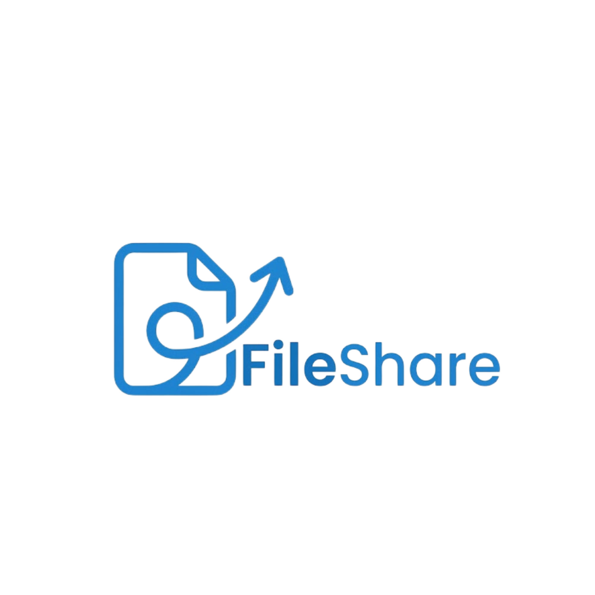
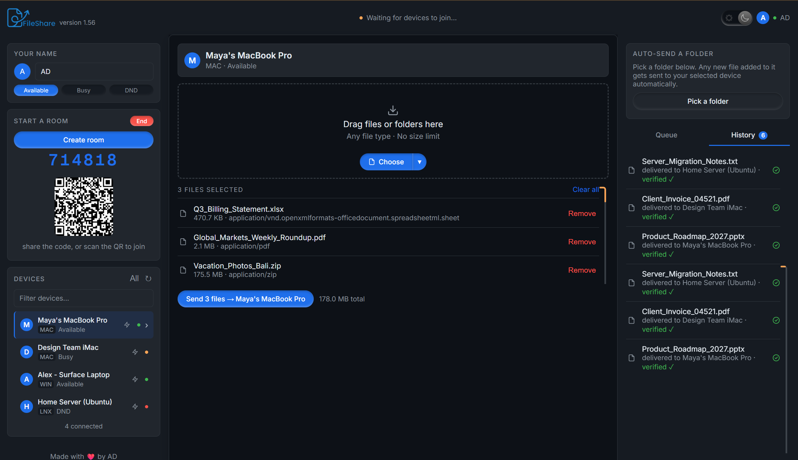

# FileShare

**Send files from one device to another, in real time. Private, peer to peer, no size limit.**

**[Open FileShare](https://wellorgs.github.io/fileshare/)** (wellorgs.github.io/fileshare). No install, no sign up, works right now in your browser.

FileShare is a free, private way to send files straight from one device to another. Think of it as an AirDrop or Nearby Share that works between any two devices: Windows, Mac, Linux, iPhone, iPad, or Android, on the same WiFi or across completely different networks. Open the page on two devices, connect with a 6 digit code or a QR scan, and drag a file over. It travels directly from one device to the other, end to end encrypted. Nothing is ever uploaded to a server.

It's useful for sending files between Windows, Mac, Linux, iPhone, iPad, and Android without installing anything, sending large files like videos or ISOs without a slow cloud upload and download round trip or a file size cap, moving files between a phone and a laptop that are on completely different networks, and as a quick, private alternative to email attachments, USB drives, or cloud storage links.

## Table of contents

- [Features](#features)
- [Quick start](#quick-start)
- [How it works](#how-it-works)
- [Privacy and security](#privacy-and-security)
- [Support this project](#support-this-project)
- [Contributors](#contributors)

## Features

- **Direct P2P transfer, end to end encrypted.** WebRTC data channels, encrypted by default. No file ever touches a server; the room code is only used to set up the connection.
- **Works on any network.** Same WiFi or LAN goes direct. Different networks fall back through a relay automatically, no VPN or port forwarding needed.
- **Room code and QR join.** No accounts, no pairing dance.
- **Multi device rooms.** A host sees every joined device. Click one to target it, or hit **All** to send to every connected device at once.
- **Folders.** Drag a folder in, or pick one from the file picker's dropdown. The whole structure sends natively and lands back in the same folder layout, no zipping needed.
- **Checksum verified transfers.** Every file is hashed on send and checked again on receipt, with a visible verified or mismatch badge, so silent corruption doesn't slip through.
- **Resumable transfers.** If a connection drops mid file, it picks up from the exact byte the receiver already has as soon as the device reconnects, no restarting from zero.
- **Live speed and ETA** on every transfer in progress.
- **Re-send** a past file from History in one click, no digging through folders again.
- **Watch folder auto sync** (Chrome/Edge). Point it at a folder, like a camera roll or downloads dump, and new files sync automatically to your selected device.
- **Device avatars, names, and status** (Available, Busy, DND), synced live across connected devices.
- **Flash to identify.** Can't tell which physical device is "Swift Falcon"? One click makes its screen flash.
- **Light and dark theme**, no page reload.

## Quick start

1. Open **[wellorgs.github.io/fileshare](https://wellorgs.github.io/fileshare/)** on both devices. Nothing to install.
2. On device A, click **Create room**. You get a 6 digit code and a QR code.
3. On device B, either scan the QR or type the code under **Join a room**, then click **Connect**.
4. Drag files onto the drop zone (or click it to browse), pick who to send to, and hit **Send**.

It works across different WiFi networks, mobile data, or completely different locations. It tries a direct connection first and automatically falls back through a relay if the two devices can't reach each other directly. The only thing it can't get around is a network that blocks WebRTC outright, like some locked down corporate firewalls.

## How it works

FileShare uses your browser's built in WebRTC to open a direct, encrypted connection between two devices. A small signaling step exchanges connection details so the two browsers can find each other, then it steps out of the way completely. From that point on, file data flows straight from one device to the other, never through a server.

If a direct connection isn't possible, for example when both devices are behind strict firewalls, it automatically falls back through a relay. That relay only ever sees traffic that's already encrypted, the same as any VPN would see.

## Privacy and security

- **No accounts, no analytics, no server side storage.** Nothing about you or your files is logged anywhere.
- **Files never pass through a server.** Only the room code does, to help two devices find each other.
- **Closing the tab ends the session.** Nothing persists anywhere but your own browser's local storage (your device name, avatar, and theme preference), and that never leaves your device.
- **This repository has no secrets, API keys, or credentials in it.** Everything it talks to uses public, keyless, or intentionally shared endpoints. Dependabot and secret scanning are enabled on this repo, and every change goes through a reviewed pull request, never a direct push to `master`.

Found a security issue? Please open an issue or reach out before disclosing it publicly.

## Support this project

FileShare is free, has no ads, and always will be. If it saved you a cloud upload or a cable and you'd like to say thanks, you can send a donation directly by UPI. No platform involved, no cut taken.

**UPI ID:** `wello33000.ibz@icici`

## Contributors

Built and maintained by AD.

---

**Keywords:** file sharing, airdrop for windows, airdrop alternative, nearby share alternative, peer to peer file transfer, p2p file sharing, webrtc file transfer, send files between devices, cross platform file sharing, no upload file transfer, no cloud file sharing, private file transfer, secure file transfer, LAN file sharing, local network file sharing, large file transfer, send large files free, quick share alternative, share files between phone and pc, wireless file transfer, browser based file sharing, no size limit file transfer, direct device to device transfer, offline file transfer, cross network file transfer.
